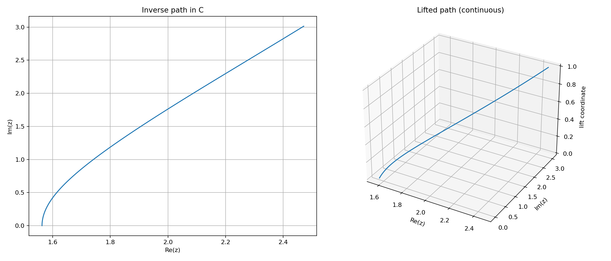
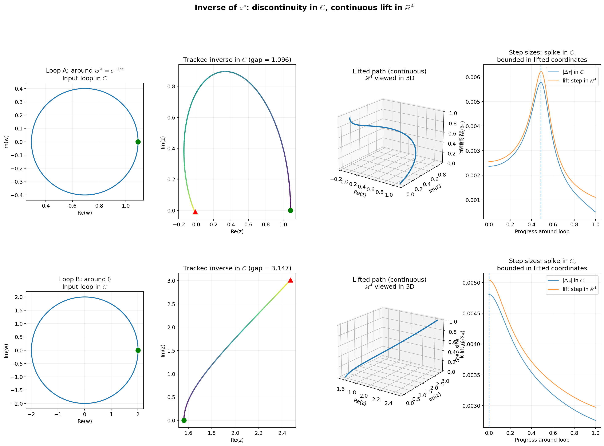
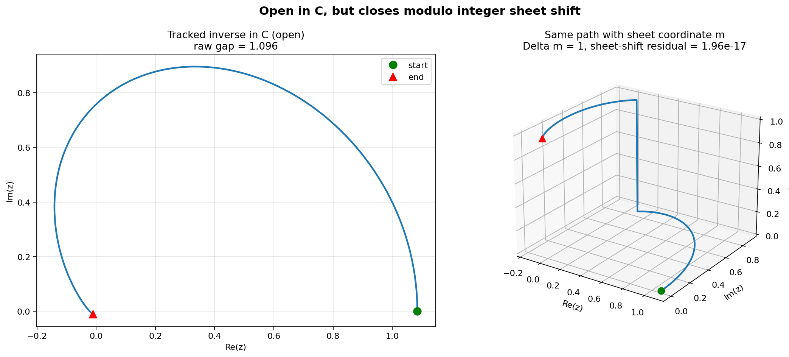

# Inverse Hyperoperator Information Conjecture

**Just want to understand what we have?** → **[WHAT_WE_ACTUALLY_HAVE.md](WHAT_WE_ACTUALLY_HAVE.md)** (one short page, no folders.)

**Conjecture:** If the inverse of an operator has branch rank *r* (independent branch parameters), then any globally continuous representation requires at least *r* extra real coordinates beyond the base value coordinates.

**First test case:** Inverse `z^z = w` (the **superlogarithm**: w → z with z^z = w) has branch rank 2, predicting a minimum of 4 real dimensions.

## Dimensional Ladder

| Level | Inverse of        | Type        | Extra coords        | Result        |
|-------|------------------|-------------|---------------------|---------------|
| 1     | addition         | algebraic   | sign                | ℤ             |
| 2     | multiplication   | algebraic   | denominators        | ℚ → ℝ         |
| 3     | exponentiation   | monodromy (r=1) | phase        | ℂ             |
| 4     | z^z / tetration  | monodromy (r=2) | 2 branch indices | ℍ?            |

## Computational Results (summary)

Two loops in the *w*-plane: Loop A around *w*∗ = e^(−1/e), Loop B around 0.

|        | Gap in ℂ | Integer branch shift (Δk, Δm) | Closure residual |
|--------|----------|-------------------------------|------------------|
| Loop A | 1.096    | (0, 1)                         | ~10⁻¹⁷           |
| Loop B | 3.147    | (1, 0)                         | 0                |

Gaps and shifts are stable from n=100 to n=6400 discretisation points. See [computational-evidence.pdf](computational-gap-detection/computational-evidence.pdf) for full write-up and limitations. **[How to demo and explain →](DEMO_AND_EXPLAIN.md)**







**Schematic (where the path closes):** 2D (z) and 4D (H) → path open; quotient of 4D → path closes. See [DIAGRAM_GUIDE.md](DIAGRAM_GUIDE.md) for which figure shows what.


## Repo Layout

- `conjecture/` — the conjecture statement and proof roadmap (LaTeX).
- `computational-gap-detection/` — numerical evidence: scripts, figures, and a LaTeX write-up of experiments.
- `quaternion-state/` — exploratory: embed 4D state in ℍ and check that deck action is translation in the (j,k)-plane (first step toward “outputs in quaternion plane”).

- `quaternions/` — quaternion super-root playground: witness `i^j = k`, power towers, and superroot heatmaps (see [quaternions/README.md](quaternions/README.md)).

## Current Evidence

- Closed loops in the `w`-plane produce open inverse paths in C (nontrivial monodromy).
- Two loops produce independent lift displacements (rank-2 shift matrix).
- Paths close after applying integer sheet shifts (deck-action closure).
- Results are stable across resolution.

## What Is Not Yet Proved

**Is this work definite and bulletproof? No.** The conjecture is a claim, not a theorem; the computations are evidence, not proof. See **[CONJECTURE_AND_STATUS.md](CONJECTURE_AND_STATUS.md)** for a short summary.

- Formal proof that monodromy group is exactly Z x Z.
- Global minimal-dimension proof (4D everywhere, not just tested loops).
- Whether the 4D structure must be quaternionic H or a more general covering-state model.

## Quickstart

```bash
python3 -m venv .venv
source .venv/bin/activate
python -m pip install numpy scipy matplotlib

# Run experiments
python computational-gap-detection/01_demo_inverse_z_to_z.py
python computational-gap-detection/02_path_completion_lift.py
python computational-gap-detection/03_closure_mod_sheet_shift.py
python computational-gap-detection/04_quotient_closure_demo.py

# Quaternion super-root (optional)
cd quaternions && pip3 install --target ./vendor numpy matplotlib && MPLCONFIGDIR=./mplconfig MPLBACKEND=Agg python3 explore_superroot.py && cd ..

# Build documents
cd conjecture && pdflatex -interaction=nonstopmode conjecture.tex && cd ..
cd computational-gap-detection && pdflatex -interaction=nonstopmode computational-evidence.tex && cd ..
```
